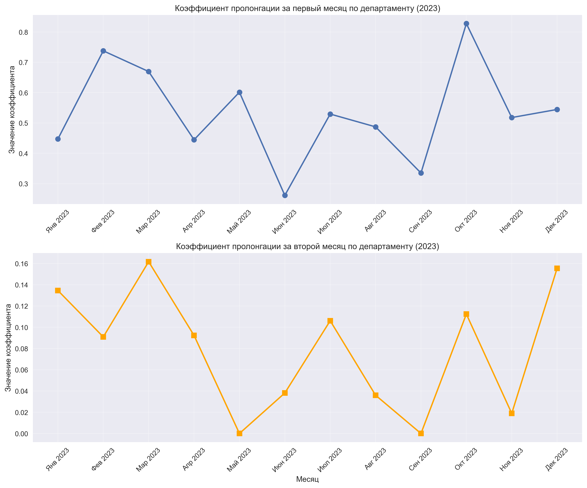
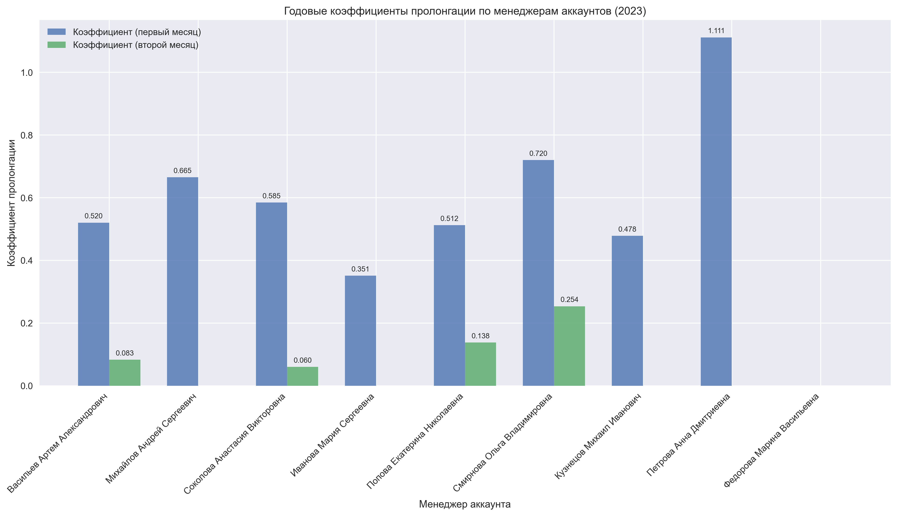
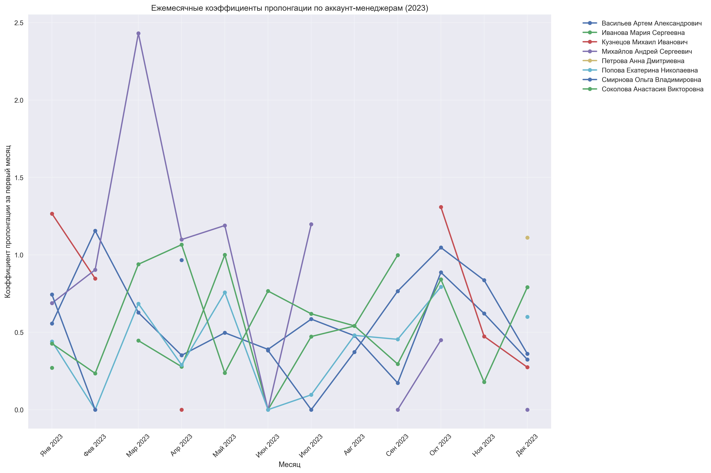
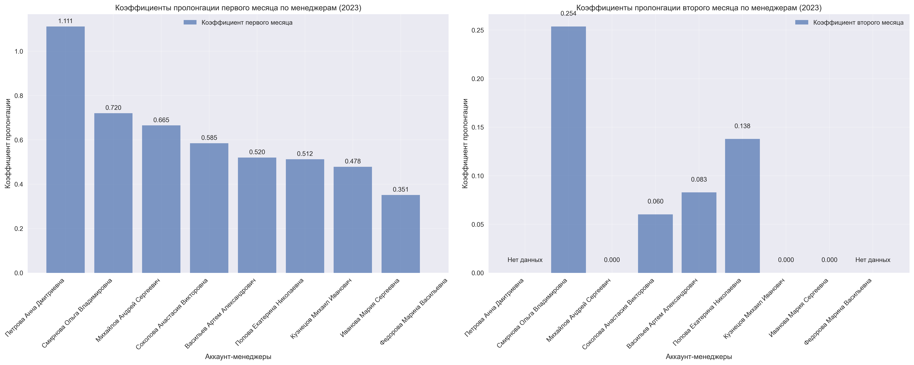

# TOPFACE Media Solution — Анализ пролонгаций


Аналитический проект для расчёта коэффициентов **C1/C2** пролонгаций по аккаунт-менеджерам и отделу.  
Формируются помесячные и годовые отчёты, визуализации и итоговый Excel-отчёт.

---

## 📊 Пример визуализаций

### 1. Динамика коэффициентов отдела
  
Показывает, как изменялись коэффициенты пролонгации **C1 и C2** для всего отдела по месяцам.

### 2. Годовое сравнение менеджеров
  
Сравнение эффективности аккаунт-менеджеров за год по коэффициенту **C1**.

### 3. Тренды по месяцам для каждого AM
  
Динамика коэффициентов пролонгации **C1 и C2** для каждого аккаунт-менеджера помесячно.

### 4. Итоговое сравнение всех менеджеров
  
Комплексное сравнение аккаунт-менеджеров по всем рассчитанным коэффициентам.


---

## 📈 Методология

В проекте рассчитываются два ключевых коэффициента пролонгации:

- **C1 (первый месяц)**  
  Отношение выручки в *m* по проектам, завершённым в *(m−1)*, к выручке этих проектов в *(m−1)*.  

- **C2 (второй месяц)**  
  Отношение выручки в *m* по проектам, завершённым в *(m−2)* и **не имевшим выручки в *(m−1)***, к выручке этих проектов в *(m−2)*.  

**Правила:**
- Источник проектов и аккаунт-менеджеров — таблица `prolongations`.  
- Суммы по месяцам — из агрегата `financial_agg`.  
- Если знаменатель = 0 или отсутствует — коэффициент не рассчитывается (`NaN`).  

---

## 🚀 Возможности
- Гармонизация месяцев и данных продаж.  
- Расчёт коэффициентов **C1/C2** по каждому аккаунт-менеджеру (2023).  
- Суммирование числителей/знаменателей для корректных расчётов.  
- Агрегация по отделу и формирование годового отчёта (**ratio-of-totals**).  
- Итоговые таблицы для дашборда и Excel.  
- Экспорт графиков (**PNG**) и отчётов (**XLSX**).  

---

## 🧱 Структура репозитория

```text
topface/
├── Charts/                                # Визуализации (PNG)
│   ├── annual_prolongation_by_manager.png
│   ├── comprehensive_manager_comparison.png
│   ├── department_prolongation_coefficients.png
│   └── monthly_trends_by_manager.png
├── data/                                  # Исходные данные (CSV/XLSX)
│   ├── financial_data.csv
│   └── prolongations.csv
├── Reports/                               # Итоговые файлы (XLSX/TXT)
│   ├── prolongation_analysis_code_explanation.txt
│   └── prolongation_analysis_report.xlsx
├── solution/                              # Код/решения
│   ├── topface_solution_code.ipynb        # Основной ноутбук
│   └── .gitkeep                           # Заглушка для папки
├── requirements.txt
├── README.md
└── .gitignore
```
---

## 📦 Установка и запуск

1. Клонируйте репозиторий:
   ```bash
   git clone https://github.com/Delalore2005/topface_media_solution.git
   cd topface_media_solution
   ```

2. Создайте виртуальное окружение:
   ```bash
   python3 -m venv .venv
   source .venv/bin/activate   # macOS/Linux
   # .venv\Scripts\activate     # Windows
   ```

3. Установите зависимости:
   ```bash
   pip install -r requirements.txt
   ```

4. Запустите Jupyter:
   ```bash
   jupyter lab
   ```
   или:
   ```bash
   jupyter notebook
   ```

---

## 🗂️ Результаты работы

- **Excel-отчёт:**  
  `prolongation_analysis_report.xlsx`  
  - Вкладки: *Monthly Results*, *Annual Results*, *Department Summary*, *Summary Statistics*

- **Визуализации (PNG):**
  - `department_prolongation_coefficients.png`
  - `annual_prolongation_by_manager.png`
  - `monthly_trends_by_manager.png`
  - `comprehensive_manager_comparison.png`

- **Документация:**  
  `prolongation_analysis_code_explanation.txt`

---

## 📑 Таблицы для дашборда

- **Помесячный отчёт** — коэффициенты C1/C2 + числители/знаменатели.  
- **Годовой отчёт** — годовые коэффициенты (**ratio-of-totals**), средние показатели, суммы баз.  
- **Помесячный отчёт по отделу** — агрегированные C1dept/C2dept и базы.  
- **Сводная статистика** — контроль полноты (число валидных месяцев для каждого AM).  

---

## 📅 Roadmap

- [ ] Автоматизировать обновление отчётов (скрипт с планировщиком).  
- [ ] Добавить CI/CD через GitHub Actions для проверки ноутбуков.  
- [ ] Расширить методологию: включить **C3 (3-й месяц)**.  
- [ ] Добавить интерактивный дашборд (Streamlit/Plotly Dash).  
- [ ] Перевести документацию и визуализации на английский для международного использования.  

---

## 👤 Контакты

Автор: **@Delalore2005**  
Вопросы и предложения — через Issues в репозитории.
